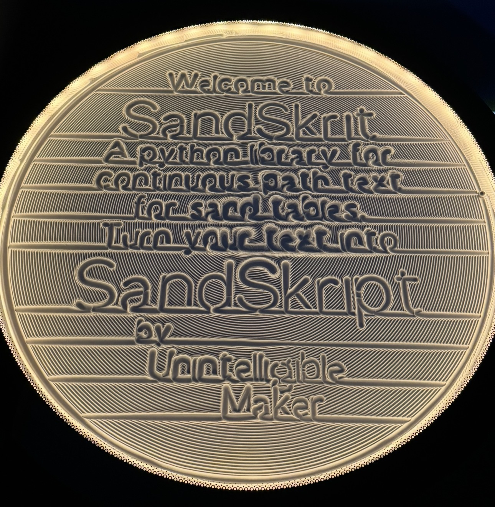
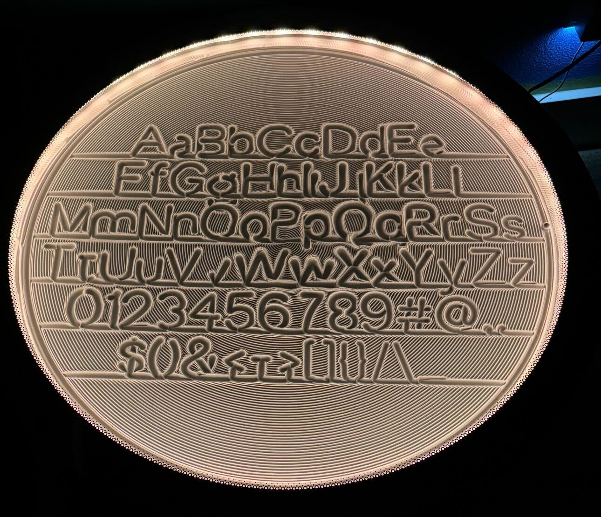

# SandSkrit

SandSkrit is a Python library for generating continuous paths (polylines) designed for use with sand tables (like Sisyphus). It allows you to create complex patterns by combining lines, spirals, circles, and text, and exports the resulting path to SVG or THR (Theta-Rho) formats.



Note: My sand is a little piled up near the center of the table still in this photo.  




## Features

- **Continuous Path Generation**: Ensures that the resulting polyline is a single, unbroken line, suitable for sand drawing robots.
- **Parametric Shapes**: Built-in support for Archimedean spirals (inward and outward), lines, and circular loops.
- **Advanced Text Rendering**: Convert strings or multiple lines of text into continuous paths with automatic boundary checking.
- **Format Support**: Export to SVG for visualization or THR for direct use with sand table controllers.
- **Extensible Character Set**: Easily add or modify characters via the `characters_data.py` module.

## Installation

SandSkrit requires Python 3.6 or later. No additional dependencies are required for the core functionality.

1. Clone the repository:
   ```bash
   git clone https://github.com/UnintelligibleMaker/Sandskrit.git
   cd Sandskrit
   ```

## Usage

The following example demonstrates how to create a simple pattern with a spiral, some text, and export it to THR and SVG.

```python
from sandskrit import SandSkrit

# Initialize at the origin
sandskrit = SandSkrit(0, 0)

# Add a spiral starting from the center
sandskrit.add_spiral_out(radius=98, turns=5, ending_angle=90)

# Add some text
sandskrit.add_string("HELLO", scale=15)

# Add a circular loop at the current radius
sandskrit.add_outer_loop(turns=1, ending_angle=180)

# Save the output
sandskrit.save_svg("output.svg")
sandskrit.save_thr("output.thr")
```

### Multiple Lines of Text

SandSkrit can also center and fit multiple lines of text within the current boundary. This is useful for creating complex labels or messages.

```python
from sandskrit import SandSkrit

sandskrit = SandSkrit(0, 0)
# Create a boundary
sandskrit.add_spiral_out(radius=100, turns=0, ending_angle=90)

multi_lines = [
    {'text': 'THIS IS WHAT', 'scale': 10},
    {'text': 'SANDSKRIT', 'scale': 20},
    {'text': 'CAN DO.', 'scale': 15},
]
sandskrit.add_lines_of_text(multi_lines)
```

See `Example.py` for a more complex example of how to use the library.

## API Overview

### `SandSkrit(x=0, y=0)`
Initializes the path at the specified starting point.

### `add_spiral_out(radius=98.0, turns=8.0, ending_angle=180.0)`
Adds an Archimedean spiral starting from the current point moving outwards.

### `add_spiral_in(turns=8.0)`
Adds an Archimedean spiral moving from the current radius towards the center.

### `add_outer_loop(turns=2.0, ending_angle=0.0)`
Adds circular loops at the current radius.

### `add_string(string, scale=5.0, ...)`
Adds a single line of text.

### `add_lines_of_text(lines_config, line_spacing=1.2)`
Adds multiple lines of text, centered vertically and horizontally within the current radius.

### `save_svg(filename, size=200)`
Saves the generated path as an SVG file.

### `save_thr(filename)`
Saves the generated path as a THR file (Theta-Rho format).

## Character Definitions

Characters are defined in `characters_data.py`. Each character entry in the `CHARACTERS` dictionary contains:

- `path`: A list of `(x, y)` tuples relative to the baseline `(0, 0)`.
- `width`: The total width of the character in the x direction.
- `start_offset`: An X-axis offset applied before drawing the character.

The coordinate system used for characters assumes:
- `y = 0`: Baseline.
- `y < 0`: Above baseline.
- `y > 0`: Below baseline (descenders).

## Output Formats

### SVG
A standard Scalable Vector Graphics file, useful for visualizing the path in any browser or vector editor.

### THR (Theta-Rho)
A format used by many sand tables. It represents points in polar coordinates:
- **Theta ($\theta$):** Cumulative angle in radians (can exceed $2\pi$ for multiple rotations).
- **Rho ($\rho$):** Normalized radius (ranging from 0 at the center to 1 at the edge).

## License

This project is licensed under the MIT License - see the [LICENSE](LICENSE) file for details.

## Code of Conduct

We are committed to providing a friendly, safe, and welcoming environment for all. Please see our [Code of Conduct](CODE_OF_CONDUCT.md) for more information.

---
Created by UnintelligibleMaker
